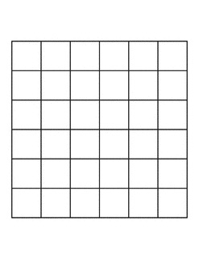

## Problem Description

To **tile** a shape is to completely cover it with smaller shapes so that there is no overhang off of the larger shape and there is no overalap for the smaller shapes on top of the larger shape.

You are allowed to rotate the shapes as if you were playing tetris. This is a **right triomino**. It is constructed from three unit ($1 \times 1$) squares.

{width=15% fig-align="center"}

Consider an $n \times n$ board. That is a square board with width $n$ units and length $n$ units. For example this is a $6 \times 6$ board.

{width=40% fig-align="center"}

This worksheet is asking questions about tiling a $n \times n$ board with right triominos.

## **Question 1** 
For $n=1$, 2, 3, 4, and 5, can you completely tile a $n \times n$ checkerboard with a right triomino pieces? You will have an answer for each $n$.

## **Question 2**
For $n=1$, 2, 3, 4, and 5, can you completely tile a $n \times n$ checkerboard with a right triomino pieces if one $1 \times 1$ square of the board is removed? That is if, you do not have to cover exactly one of the tiles, can you then tile the $n \times n$
board with right triominos. (Bonus Question: Does the answer depend on which tile you remove?)

## **Question 3** 
Can you come up with a condition $n$ that will ensures that you **cannot** tile a $n\times n$ board?

## **Question 4**
Is there a condition on $n$ that you can come up with that
ensures you can always tile $n \times n$ board if $n$ satisfies the
condition?

## **Question 5** 
Is there a condition on $n$ that you can come up with that ensures you can always tile $n \times n$ board with one tile removed?

::: {.figure text-align="center"}

{width=22%}
{width=22%}
{width=22%}
{width=22%}

:::