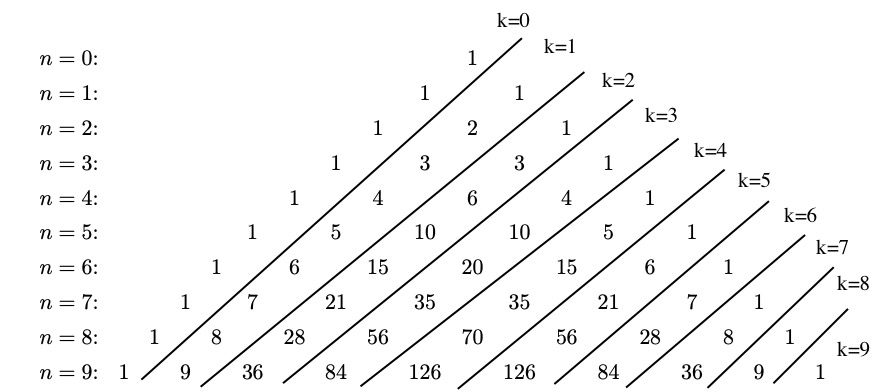

## Binomial Coefficients

Class Session Goals:

1. Present Binomial Coefficients, Pascal's Triangle, and Unordered Selection Table
2. Practice turning patterns into expression and Formulas
3. Present Combinatorial Proof of Pascal Triangle Identity
4. Present Induction Proof of Binomial Theorem

---

## Unordered Selections

The number of ways to choose $k$ times from $n$ objects where order does
not matter and repetition is not allowed is
$$\binom{n}{k}=\frac{n!}{(n-k)!k!}$$ for $n$ and $k$ and $n \ge k$ and 0
if $n <k$.

---

## Table of Unordered Selections

Values of $\binom{n}{k}$ for $n=0,\ldots, 5$ and $k=0,\ldots, 5$.

$$\begin{array}{rcccccc}
 & k=0 & k=1 & k=2 & k=3 & k=4 & k=5\\
n=0: &1 & 0 & 0 & 0 & 0& 0 \\
n=1:&1 & 1 & 0 & 0 & 0 & 0\\
n=2:&1 & 2 & 1 & 0 & 0 & 0\\
n=3:&1 & 3 & 3 & 1 & 0 & 0\\
n=4:&1 & 4 & 6 & 4 & 1 & 0\\
n=5: &1 & 5 & 10 & 10 & 5 & 1\\
\end{array}$$

---

## Binomial Expansion

The expression $(x+y)^n$ is called a binomial expansion. The
coefficients of monomials $x^ky^{n-k}$ are called binomial coefficients.
Below are binomial expansion for $n=0,\ldots, 5$

$$\begin{array}{c}
 1 \\
 x+y \\
 x^2+2 x y+y^2 \\
 x^3+3 x^2 y+3 x y^2+y^3 \\
 x^4+4 x^3 y+6 x^2 y^2+4 x y^3+y^4 \\
 x^5+5 x^4 y+10 x^3 y^2+10 x^2 y^3+5 x y^4+y^5 \\
\end{array}$$

---

## Pascal's Triangle

$$
\begin{array}{ccccccccccccccccc}
&&&&&&&&1\\
&&&&&&&1&&1\\
&&&&&&1&&2&&1\\
&&&&&1&&3&&3&&1\\
&&&&1&&4&&6&&4&&1\\
&&&1&&5&&10&&10&&5&&1\\
&&1&&6&&15&&20&&15&&6&&1\\
&1&&7&&21&&35&&35&&21&&7&&1
\end{array}
$$

---

## Activity

In small groups, work on the "Patterns and Formulas in Pascals Triangle"
worksheet. The goals of this worksheet are to:

1. Identify Patterns in Pascals Triangle
2. Create mathematical equations that represent these patterns

---

## Pascal's Triangle

{width=60% fig-align="center"}

---

## Pascal's Triangle

$$
\begin{array}{ccccccccccccccccc}
&&&&&&&&1\\
&&&&&&&1&&1\\
&&&&&&1&&2&&1\\
&&&&&1&&3&&3&&1\\
&&&&1&&4&&6&&4&&1\\
&&&1&&5&&10&&10&&5&&1\\
&&1&&6&&15&&20&&15&&6&&1\\
&1&&7&&21&&35&&35&&21&&7&&1
\end{array}
$$

---

## Activity's Formulas

  ------------------------------------- ---------------------------------------------------
  **Pascal's Triangle Identity**:       $\binom{n-1}{k}+\binom{n-1}{k-1}=\binom{n}{k}$
  **Left-Right Symmetry Formula**:      $\binom{n}{k}=\binom{n}{n-k}$
  **Hockey Stick Formula**              $\sum_{i=0}^{k}\binom{n+i}{n}=\binom{n+k+1}{n+1}$
  **Sum of Rows Formula**               $\sum_{k=0}^{n}\binom{n}{k}=2^n$
  **Alternating Sum of Rows Formula**   $\sum_{k=0}^{n}(-1)^k\binom{n}{k}=0$
  ------------------------------------- ---------------------------------------------------

## Pascal's Triangle Identity

$$\binom{n-1}{k}+\binom{n-1}{k-1}=\binom{n}{k}$$ or
$$\binom{n}{k}+\binom{n}{k-1}=\binom{n+1}{k}$$ By substituting $n+1$ in
for $n$.

This explains the connection between the table of unordered selection
numbers and Pascals Triangle.

---

## Binomial Theorem

For $n\ge 0$,
$(x+y)^n= \sum^{n}_{k=0}\binom{n}{k}x^ky^{n-k}$

This explains the connection between the table of unordered selection numbers and Pascals
Triangle.

---