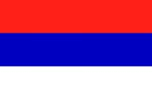
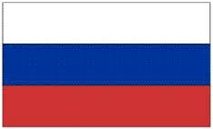
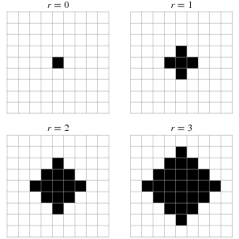
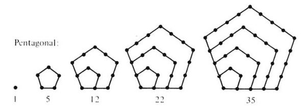
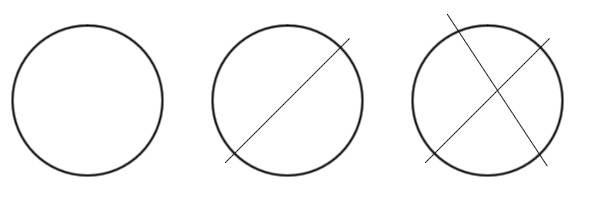
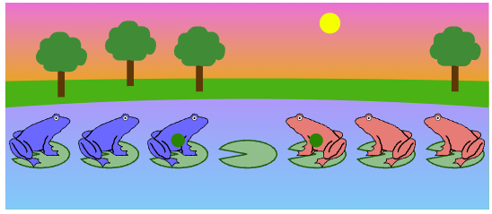

## Introduction to Recursion

Chapter 2 covers using recursion to count objects. Two important
questions to ask are: If I know the answer for the $n$ case, what do I
need to do to get the answer to the $n+1$ case? Can I find a smaller
versions of the problem in the problem I am working on? Class Session
Goals:

1. Present recursion in the mathematical context
2. Practice creating recursive formulas for sequences

---

## Interesting Mathematical Sequences

  Sequence                       Name         OEIS
  ------------------------------ ------------ ---------
  $1,2,3,4,5,6, \ldots$          Counting     A000027
  $1,3,6,10,15,21, \ldots$       Triangular   A000217
  $1,4,9,16,25,36, \ldots$       Square       A000290
  $1,1,2,3,5,8, \ldots$          Fibbonacci   A000045
  $0, 2, 5, 9, 14, 20, \ldots$   ???          A000096

Sequences give the answer to questions like: 

1. What is the sum of the first $n$ integers?
2. What is the sum of the first $n$ odd integers?
3. How many diagonals are there in a $n+2$-gon?

---

## Recursive and Closed Formula

We can express sequences recursively or in a closed form. Closed form
means as a function of $n$.

  Numbers           Initial Condition   Recursive Relationship   Closed Form
  ----------------- ------------------- ------------------------ ------------------------
  Counting          $c_1=1$             $c_n=c_{n-1}+1$          $c_n=n$
  Triangular        $T_1=1$             $T_n=T_{n-1}+n$          $T_n=\frac{n(n+1)}{2}$
  Square            $S_1=1$             $S_n=S_{n-1}+2n-1$       $S_n=n^2$
  Fibbonacci        $F_1=1,F_2=1$       $F_n=F_{n-1}+F_{n-2}$    $T_n=???$
  $n+2$-gon Diags   $D_1=0$             $D_n=???$                $D_n=\frac{n(n+3)}{2}$

---

## Definitions

The **order** of a recursive formula is the number of preceding values
that are needed to calculate the next value. For example, the Fibonnacci
recursion has order 2, and the Triangular number recursion has order 1.

A recurrence is called **linear** if it has the form
$$a_n=c_1\cdot a_{n-1}+c_2\cdot a_{n-2} \cdots + c_k\cdot a_{n-k} +f(n)$$
where $c_i$ are real numbers and $f(n)$ is a function of $n$.

---

## More Definitions

$$a_n=c_1\cdot a_{n-1}+c_2\cdot a_{n-2} \cdots + c_k\cdot a_{n-k} +f(n)$$

If $f(n)=0$ the recurrence is called **homogeneous** and if $f(n) \ne0$ the recurrence is called **non-homogeneous**. All the examples on the previous slide are linear, but the Fibbonacci sequence is the only homogenous linear example on the last slide.

If a recurrence is not linear, the it is called a **non-linear**
recurrence relation. An example of a non-linear recurrence is
$a_n=a_{n-1}\cdot a_{n-3}$.

---

## Goal for the next two classes

The most challenging part of chapter 2 is going from a counting problem to a recursive representation of the problems. We will explore two ways to do this motivated the following two questions.

1. Can I find patterns in the differences in small $n$ data?

2. Can I find smaller versions of my problem?

---

## Recursion Activity

For the remainder of the next two classes, we will work on a number of counting problems where the goal is to find a recursive formula that gives the answers to the following counting problems. In the next few classes we will learn how to calculate a closed form solution if we have a recursive description of the solution.

$F_n$ - number of different $n$ strip flags

$V_n$ - area of the $n$th Von Neumann neighborhood

$P_n$ - $n$th Pentagonal number

$C_n$ - maximum pieces of cake with $n$ cuts

$T_n$ - minimum number of moves to win $n$-version of frogs and toads game

---

## Flags

Suppose you have 3 colors, and you are creating a flag with $n$
horizontal stripes with the condition that adjacent stripes must be
different colors. Let $F_n$ be the number of ways to create an $n$
stripe flag. Can you express $F_n$ as a recursion? Can you find a closed
form? Some examples of a 3 stripe flag.

::: {style="text-align:center;"}

{width=18%}
{width=18%}
{width=18%}
{width=18%}
{width=18%}

:::

---

## Von Neumann Neighborhoods

What is the size of the $n$th Von Neumann Neighborhood? Let $V_n$ be the
number of squares in the $n$th Von Neumann Neighborhood. Can you find a
recursive formulas for $V_n$? Can you find a closed form?

{width=18%}

---

## Pentagonal Numbers

How many dots are in the $n$th pentagonal diagram? Let $P_n$ be the
number of dots in the $n$th pentagonal diagram. Can you find a recursive
formulas for $P_n$? Can you find a closed form?

{width=18%}

$P_1=1$, $P_2=5$, $P_3=12$, $P_4=22$, $P_5=35$

---

## Lazy Caterer

What is the maximum number of pieces you can cut a circular cake into
with $n$ cuts, call this $C_n$? Can you express $C_n$ as a recursion?
Can you find a closed form? Pictures for $n=0,1,2$.

{width=18%}

---

## Frogs and Toads Game

What is the minimum number of it take to complete the $n$-frog and $n$-toad Frogs & Toads puzzple? Call this number $T_n$ Here is the $n=3$ version.  One move is moving one amphibian to an adjacent pad or jumping over one of the other species.

{width=18%}

---

## Link to Frogs and Toads Game

{width=18%}

---

