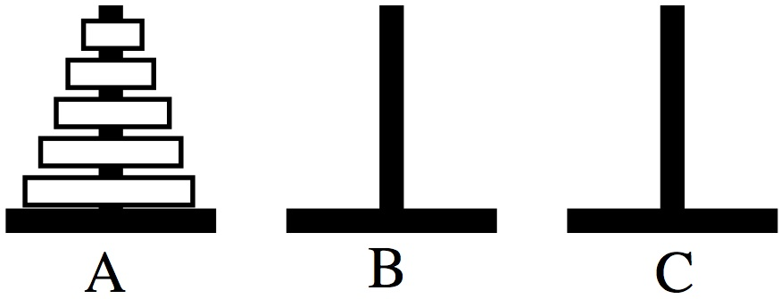
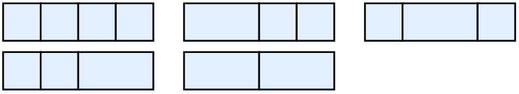
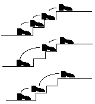

## Introduction to Recursion

Chapter 2 covers using recursion to count objects. Two important
questions to ask are: If I know the answer for the $n$ case, what do I
need to do to get the answer to the $n+1$ case? Can I find a smaller
versions of the problem in the problem I am working on? Class Session
Goals:

1. Present recursion in the mathematical context
2. Practice creating recursive formulas for sequences

---

## Interesting Mathematical Sequences

  Sequence                       Name         OEIS
  ------------------------------ ------------ ---------
  $1,2,3,4,5,6, \ldots$          Counting     A000027
  $1,3,6,10,15,21, \ldots$       Triangular   A000217
  $1,4,9,16,25,36, \ldots$       Square       A000290
  $1,1,2,3,5,8, \ldots$          Fibbonacci   A000045
  $0, 2, 5, 9, 14, 20, \ldots$   ???          A000096

Sequences give the answer to questions like: What is the sum of the
first $n$ integers? What is the sum of the first $n$ odd integers? How
many diagonals are there in a $n+2$-gon?

---

## Recursive and Closed Formula

We can express sequences recursively or in a closed form. Closed form
means as a function of $n$.

  Numbers           Initial Condition   Recursive Relationship   Closed Form
  ----------------- ------------------- ------------------------ ------------------------
  Counting          $c_1=1$             $c_n=c_{n-1}+1$          $c_n=n$
  Triangular        $T_1=1$             $T_n=T_{n-1}+n$          $T_n=\frac{n(n+1)}{2}$
  Square            $S_1=1$             $S_n=S_{n-1}+2n-1$       $S_n=n^2$
  Fibbonacci        $F_1=1,F_2=1$       $F_n=F_{n-1}+F_{n-2}$    $T_n=???$
  $n+2$-gon Diags   $D_1=0$             $D_n=???$                $D_n=\frac{n(n+3)}{2}$

---

## Definitions

The **order** of a recursive formula is the number of preceding values
that are needed to calculate the next value. For example, the Fibonnacci
recursion has order 2, and the Triangular number recursion has order 1.

A recurrence is called **linear** if it has the form
$$a_n=c_1\cdot a_{n-1}+c_2\cdot a_{n-2} \cdots + c_k\cdot a_{n-k} +f(n)$$
where $c_i$ are real numbers and $f(n)$ is a function of $n$.

---

 If $f(n)=0$ the recurrence is called **homogeneous** and if $f(n) \ne0$ the
recurrence is called **non-homogeneous**. All the examples on the
previous slide are linear, but the Fibbonacci sequence is the only
homogenous linear example on the last slide.

If a recurrence is not linear, the it is called a **non-linear**
recurrence relation. An example of a non-linear recurrence is
$a_n=a_{n-1}\cdot a_{n-3}$.

---

## Goal for the next two classes

The most challenging part of chapter 2 is going from a counting problem
to a recursive representation of the problems. We will explore two ways
to do this motivated the following two questions.

1. Can I find patterns in the differences in small $n$ data?
2. Can I find smaller versions of my problem?

---

## Recursion Activity

For the remainder of the next two classes, we will work on a number of
counting problems where the goal is to find a recursive formula that
gives the answers to the following counting problems. In the next few
classes we will learn how to calculate a closed form solution if we have
a recursive description of the solution.

$H_n$ - minimum moves needed to solve a Tower of Hanoi problem with

$T_n$ - tilings of a $1\times n$ board by $1 \times 2$ and $1 \times 1$
tiles

$S_n$ - different ascents of an $n$-stair staircase

$B_n$ - binary strings of length $n$ that include 00

---

## Towers of Hanoi

What is the smallest number of moves to solve the Towers of Hanoi puzzle
with $n$ disks.? Let $H_n$ be the minimun moves in an $n$-disk solution.
What are some initial values? Can you find a recursive formulas for
$H_n$? Can you find a closed form?

{width=18%}

---

## Tiling a sidewalk

How many ways can you tile a $1 \times n$ board with a $1 \times 1$
squares and $2 \times 1$ rectangles, call this $T_n$? Can you express
$T_n$ as a recursion?  Here are five possible
tilings of a $1 \times 4$ board.

{width=18%}

---

## Staircase Problem

How many ways can you walk up a staircase with $n$ stairs if you can
choose 1, 2, or 3 steps to ascent? Let $S_n$ be the number of different
ascents of a $n$-step staircase. Can you express $S_n$ as a recursion?
Can you find a closed form? 

{width=18%}

---

## Binary Stings

How many binary strings of length $n$ are there that include a 00, i.e
two adjacent zeros? Can you express $B_n$ as a recursion? 

---

## Tiling a board

How many ways can you tile a $2 \times n$ board with $1 \times 1$ and $2 \times 1$ tiles?  The $2 \times 1$ tiles can be rotated.  Can you express this sequence $a_n$ as a recurrence?ß

---
